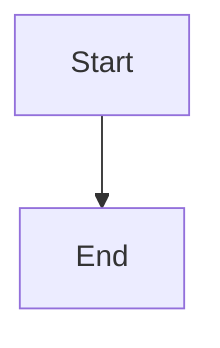

# AGENTS.md

Guidance for AI coding agents working in this repository.

## Project

Personal website & blog: **Astro 7 + React 19 + TypeScript + shadcn/ui + Tailwind CSS v4**.

Static site (no SSR adapter). Content-driven: blog posts and project showcases via Astro content collections (MDX).

Author: Miles Pan (mpan1206). Site language: zh-CN. Live at <https://mpan.dev>.

## Stack

| Layer           | Choice                                                                                                     |
| --------------- | ---------------------------------------------------------------------------------------------------------- |
| Framework       | Astro 7 (`astro` ^7), file-based routing in `src/pages/`                                                   |
| UI islands      | React 19 via `@astrojs/react`                                                                              |
| Components      | shadcn/ui `base-nova`; primitives from `@base-ui/react`                                                    |
| Styling         | Tailwind CSS v4 via `@tailwindcss/vite`, CSS variables in `@theme inline`, `tw-animate-css` for animations |
| Content         | Astro content collections (MDX via `@astrojs/mdx`), glob loader                                            |
| Code blocks     | `astro-expressive-code` (github-light / github-dark themes)                                                |
| Diagrams        | `rehype-mermaid` (build-time SVG rendering of standard ```mermaid code blocks)                             |
| Search          | `pagefind` ^1 (post-build index, React UI in `src/components/search/`)                                     |
| OG images       | `satori` ^0.26 + `sharp` — dynamic PNG generation (`src/lib/og/`, `src/pages/og.png.ts`)                   |
| Icons           | `lucide-react` + `react-icons` (for social/share icons)                                                    |
| Font            | Inter Variable (`@fontsource-variable/inter`) + Noto Sans SC Bold (OG images)                              |
| Language        | TypeScript strict (`extends: astro/tsconfigs/strict`), path alias `@/*` → `./src/*`                        |
| Package manager | **pnpm** only (`packageManager` pinned in `package.json`)                                                  |
| Node            | `engines.node` `>=22.12.0`                                                                                 |

## Commands

```bash
pnpm install       # install deps
pnpm dev           # dev server
pnpm build         # astro build + pagefind --site dist (search index)
pnpm preview       # preview production build
pnpm lint          # ESLint (flat config; **/*.{ts,tsx} only)
pnpm format        # Prettier write (astro + tailwindcss plugins)
pnpm format:check  # Prettier check
pnpm typecheck     # astro check (.astro + .ts/.tsx)
```

CI (`.github/workflows/ci.yml`) runs: `lint` → `format:check` → `typecheck` → `build` with `pnpm install --frozen-lockfile`.

Add shadcn/ui components (prefer CLI over hand-rolling equivalents):

```bash
npx shadcn@latest add <component>
```

Config: `components.json` (style `base-nova`, CSS variables, aliases under `@/`).

## Layout

```
src/
├── assets/                    # Assets processed by Vite (fonts, images)
│   ├── fonts/                 # Custom local fonts
│   └── images/                # Local images
├── pages/                     # Routes (.astro → URLs)
│   ├── index.astro            # /
│   ├── 404.astro              # 404
│   ├── robots.txt.ts          # /robots.txt (dynamic)
│   ├── rss.xml.ts             # /rss.xml
│   ├── og.png.ts              # /og.png (default OG image)
│   ├── posts/
│   │   ├── index.astro        # /posts/ (blog listing)
│   │   ├── [slug].astro       # /posts/:slug (blog post)
│   │   └── [slug].png.ts      # /posts/:slug/og.png (per-post OG)
│   └── projects/
│       └── index.astro        # /projects/ (project listing)
├── layouts/                   # Layout shells
│   ├── Layout.astro           # Base layout (imports global CSS, header, footer)
│   └── PostLayout.astro       # Blog post layout (TOC, reading time, tags, share)
├── components/
│   ├── ui/                    # shadcn/ui primitives (button, badge, card, dropdown-menu,
│   │                          #   separator, sheet, skeleton, tooltip)
│   ├── search/                # Pagefind search UI (React)
│   │   ├── Search.tsx         # Search orchestrator
│   │   ├── SearchDialog.tsx   # Modal/dialog shell
│   │   ├── SearchTrigger.tsx  # Open button (⌘K)
│   │   ├── SearchInput.tsx    # Query input
│   │   ├── SearchResults.tsx  # Result list
│   │   ├── SearchHit.tsx      # Single result item
│   │   ├── SearchGroup.tsx    # Grouped results
│   │   ├── SearchEmpty.tsx    # Empty state
│   │   ├── SearchLoading.tsx  # Loading state
│   │   ├── SearchFooter.tsx   # Footer with nav hints
│   │   └── hooks/             # usePagefind, useKeyboard, useMobile
│   ├── Header.astro           # Site header (logo, nav, theme toggle, mobile menu, search trigger)
│   ├── Footer.tsx              # Site footer
│   ├── Main.astro             # Content wrapper
│   ├── ThemeToggle.astro      # Light/dark toggle
│   ├── MobileMenu.tsx          # Mobile nav
│   ├── BackButton.astro       # Back navigation
│   ├── BackToTop.astro        # Scroll-to-top button
│   ├── TableOfContents.astro  # Desktop TOC
│   ├── MobileTableOfContents.tsx  # Mobile TOC
│   ├── PostCard.tsx            # Blog post card
│   ├── ProjectCard.tsx         # Project card
│   ├── Callout.tsx             # MDX callout/admonition
│   └── SocialIcon.tsx          # Social link icon
├── content/
│   ├── posts/                 # Blog posts (.md / .mdx)
│   └── projects/              # Project pages (.md / .mdx)
├── lib/
│   ├── utils.ts               # cn() — clsx + tailwind-merge
│   └── og/                    # OG image generation (satori)
│       ├── fonts.ts           # Font loading for OG images
│       ├── renderer.ts        # Satori render pipeline
│       ├── templates.ts       # OG image layout templates
│       ├── theme.ts           # OG image color scheme
│       ├── types.ts           # OG image types
│       └── cache.ts           # In-memory render cache
├── utils/
│   ├── getPostPaths.ts        # Collect post slugs for static paths
│   ├── readingTime.ts         # Word-count based reading time
│   ├── share-url.ts           # Share URL builders (Twitter, Weibo, QQ)
│   ├── sitemap.ts             # lastmod resolver for sitemap
│   └── withBase.ts            # Base path helper
├── styles/
│   ├── global.css             # Tailwind imports, @theme inline, :root / .dark tokens
│   ├── theme.css              # Design tokens
│   ├── animations.css         # Keyframes and animation utilities
│   ├── components.css         # Component-specific styles
│   └── utilities.css          # Utility classes
├── scripts/
│   └── theme.ts               # Client-side theme toggle script (inline in <head>)
├── config.ts                  # Site config (meta, nav, social, share)
├── types.ts                   # Config type definitions + defineConfig helper
├── content.config.ts          # Content collection schemas (posts + projects)
└── env.d.ts                   # Astro + React type references
public/                         # Static assets (favicon, logos, fonts, images)
```

## Patterns

### Content collections

Posts and projects are defined as Astro content collections in `src/content.config.ts` using the glob loader. Each uses Zod schemas for frontmatter validation.

**Posts** (`src/content/posts/`): title, description, publishDate, tags (optional), image (optional), featured (optional).

**Projects** (`src/content/projects/`): title, description, publishDate, tags, image, githubUrl, featured, status, language, license (all optional except title/description/publishDate).

### Astro + React

- Prefer **Astro** for pages, layouts, and static structure.
- Use **React** for interactive UI; hydrate from `.astro` with a client directive (e.g. `client:load`).
- Import UI from `@/components/ui/...` and shared helpers from `@/lib/...`.
- Config values from `@/config` (site meta, nav, social links).

```astro
---
import Layout from '@/layouts/Layout.astro'
import { Button } from '@/components/ui/button'
---

<Layout>
  <Button client:load>Click</Button>
</Layout>
```

### Config-driven site

`src/config.ts` defines all site-level data via a typed `defineConfig()` helper:

- `site.meta` — title, author, description, URL, email
- `site.locale` — lang (zh-CN), dir, timezone
- `site.brand` — favicon, logo, themeColor
- `nav` — navigation links (href + label)
- `social` — social links with placement control (navbar, hero, footer)
- `share` — share targets (Twitter, Weibo, QQ)

Import config with `import config from '@/config'`. Use `config.site.meta.title`, etc.

### Search (Pagefind)

Search is powered by [Pagefind](https://pagefind.app/), a static-search library. The build step runs `pagefind --site dist` after `astro build` to index the static output. The React search UI in `src/components/search/` consumes the Pagefind JS API via the `usePagefind` hook.

### OG image generation

Dynamic Open Graph images are generated at build time using `satori` (JSX → SVG → sharp → PNG). The pipeline lives in `src/lib/og/`:

- `fonts.ts` loads Inter + Noto Sans SC Bold
- `templates.ts` defines the image layout as JSX
- `renderer.ts` wraps satori + sharp
- `cache.ts` provides an in-memory LRU cache for renders

Endpoints: `/og.png` (default) and `/posts/:slug/og.png` (per-post).

### Components & class names

- Variants: `class-variance-authority` (`cva`); merge with `cn()` from `@/lib/utils`.
- Prefer semantic theme tokens: `bg-background`, `text-foreground`, `bg-primary`, `border-border`, etc.
- Theme tokens live across `src/styles/theme.css` (design tokens) and `src/styles/global.css` (`:root` / `.dark`, `@theme inline`).
- Animation utilities: `src/styles/animations.css`; use `tw-animate-css` classes where applicable.
- Icons: `import { IconName } from 'lucide-react'` (UI icons) or `react-icons` (social/share brand icons).

### Mermaid diagrams

Mermaid diagrams are rendered at build time via `rehype-mermaid`. Use standard Markdown code blocks with the `mermaid` language:

````markdown

````

```

### Expressive Code

Code blocks in MDX are rendered by `astro-expressive-code`. Themes: `github-light` / `github-dark`, switching via `.dark` selector. No dark-mode media query — theme is toggled by a class on `<html>`.

### Tooling conventions

- Prettier: no semicolons, single quotes, trailing commas `es5`, print width 100.
- ESLint flat config (`eslint.config.js`): JavaScript config (not .mjs), covers `**/*.{ts,tsx}`, ignores `dist` and `.astro`.
- Husky + lint-staged on commit: `*.{ts,tsx}` → eslint --fix + prettier; everything else → prettier only.
- Use **pnpm**, not npm/yarn, for installs and scripts.

## Agent rules

1. **Match existing style** — Read nearby files before editing; keep naming, imports, and formatting consistent.
2. **Minimal diffs** — Change only what the task needs; no drive-by refactors or unrelated file churn.
3. **Do not commit secrets** — No API keys, tokens, or `.env` contents (`.env*` is gitignored).
4. **Prefer CLI for shadcn** — `npx shadcn@latest add <name>`; avoid inventing a parallel UI kit.
5. **Do not hand-edit lockfile** — Change deps via `pnpm add` / `pnpm remove`.
6. **Verify before claiming done** — At minimum run what CI runs for your change: `pnpm lint`, `pnpm format:check`, `pnpm typecheck`, and `pnpm build` when relevant.
7. **Astro client directives** — Interactive React components used from `.astro` need an appropriate `client:*` directive.
8. **Path alias** — Use `@/` for `src/` imports; avoid deep relative paths when the alias works.
9. **Content changes** — Posts and projects go in `src/content/`; validate frontmatter against schemas in `content.config.ts`.
10. **Build includes Pagefind** — `pnpm build` also runs `pagefind --site dist`; the build output must include a search index.
11. **CSS organization** — Global tokens in `theme.css` and `global.css`; animations in `animations.css`; component styles in `components.css`; utilities in `utilities.css`. New component styles go in the right file.
12. **Config, not hardcoding** — Use `src/config.ts` for site metadata, nav links, and social links instead of hardcoding values in templates.

## Out of scope (unless asked)

- Rewriting the design system away from shadcn / base-nova / `@base-ui/react`
- Switching package managers or Node major without reason
- Adding SSR, an Astro adapter, backend, auth, or DB without an explicit request
- Changing the content collection schema or loader strategy

## Related docs

- `README.md` — quick start for adding/using shadcn components
- `components.json` — shadcn generator config
- `src/config.ts` — site-wide configuration
- `src/content.config.ts` — content collection schemas
- `src/types.ts` — TypeScript type definitions for config
- `.github/workflows/ci.yml` — required checks on PRs
```
