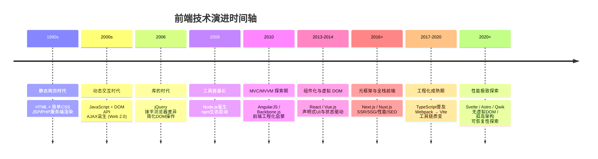
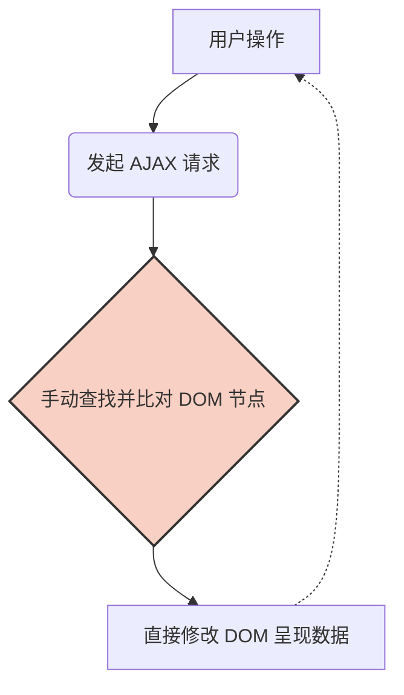
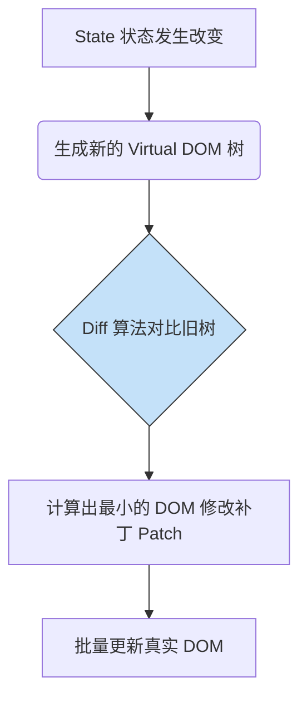
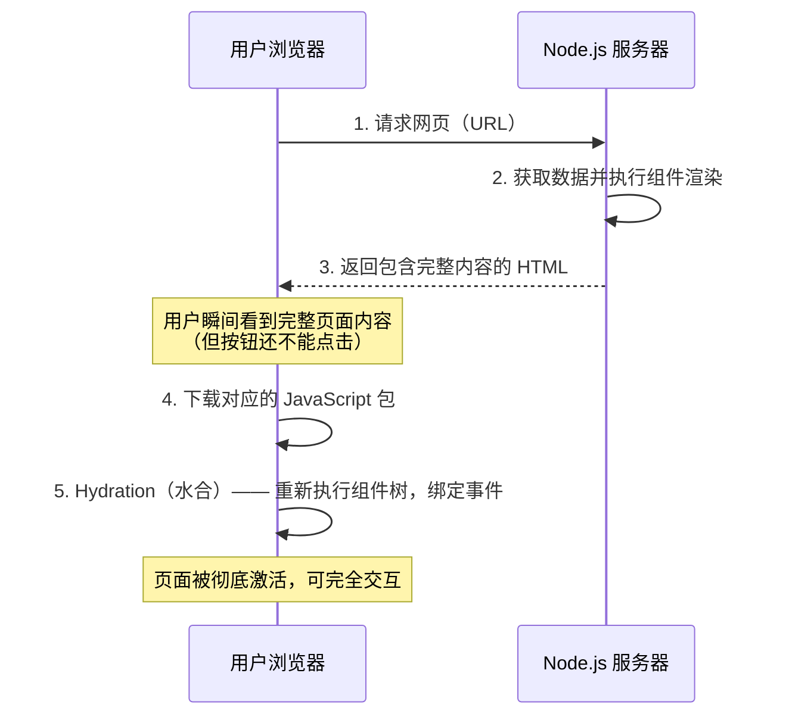

前端开发的历史，就是一部不断追求**用户体验（UX）**和**开发者体验（DX）**的进化史。让我们用图表和通俗的解析，带你理清前端从刀耕火种到现代化工厂的发展脉络。

## 📅 前端演进时间轴

---

## 第一阶段：纯静态时代 —— Web 1.0（1990s）

在这个阶段，网页就是放在服务器上的一堆文本文件。内容的动态部分由服务器端语言（如 **JSP**、**PHP**、**ASP**）负责在服务端拼接 HTML 字符串，再整体推送给浏览器——这是"服务端渲染"最原始的形态，也是后来 SSR 回归时的历史对照点。

- **技术栈**：HTML（负责内容结构）+ CSS（负责样式）+ JSP/PHP（服务端动态生成内容）。
- **工作模式**：浏览器向服务器发送请求，服务器执行脚本、查询数据库、拼接完整 HTML，浏览器原样渲染。
- **痛点**：每次点击链接，整个页面都要白屏并重新加载。客户端几乎没有交互能力，像在看电子报纸。

> **演进动力**：用户不满足于只读内容，渴望在网页上进行实时交互（如表单即时验证、局部内容刷新），而不必每次都等待整个页面重载。

---

## 第二阶段：动态交互与 jQuery 帝国（2000s - 2010）

为了让网页动起来，**JavaScript** 被内嵌进浏览器。随后，**AJAX**（Asynchronous JavaScript and XML）技术打破了"每次操作都要刷新整个页面"的魔咒，局部数据更新成为现实，Web 2.0 时代由此开启。

**jQuery**（2006 年）则将"浏览器兼容性地狱"的问题一举化解，开发者终于可以用统一的 API 操作 DOM，无需再为 IE 和 Firefox 的差异焦头烂额。

- **技术栈**：HTML/CSS + JavaScript + AJAX + jQuery。
- **工作模式**：服务器渲染主体 HTML，客户端通过 jQuery 监听事件 → 发送 AJAX 请求 → 获取数据 → **手动查找并修改 DOM**（例如 `$('#app').append(...)`）。
- **痛点（面条式代码）**：随着交互越来越复杂，频繁且直接地操作 DOM 导致代码逻辑极其混乱，数据和视图高度耦合，维护起来像一团乱麻。

> **演进动力**：复杂的 DOM 操作让开发者痛不欲生，需要一种更好的方式来组织代码，将**数据（Model）**和**视图（View）**分离开来，提升代码的可维护性。

---

## 第三阶段：前端工程化启蒙——MVC/MVVM 时代（2010 - 2013）

为了解决代码组织问题，前端开始引入后端的架构思想。以 **AngularJS (1.x)** 为代表的框架横空出世，首次将 MVC 概念系统性地引入浏览器端。

**核心创新：双向数据绑定**。开发者只需关注数据（变量），数据变了视图自动更新；用户在视图输入了内容，数据也自动同步。从此告别繁琐的手动 DOM 操作。

- **痛点**：
  - AngularJS 使用**脏检查机制**（`$digest` cycle）：每次触发"消化周期"时，框架会遍历所有注册的 watcher（观察者）来检测数据变化。当页面绑定的 watcher 数量超过约 2000 个时，性能会急剧下降。
  - 双向绑定在复杂应用中会导致数据流向像蜘蛛网一样难以追踪，出现 bug 时极难定位根源。

**同期值得一提的是**，**Node.js（2009 年）**的诞生让 JavaScript 进入了服务器端运行时，更深远的影响是催生了 npm 包生态，以及后来 Grunt、Gulp、Webpack 等前端构建工具的出现——没有这套工具链，组件化开发模式很难大规模落地。

> **演进动力**：脏检查带来的性能瓶颈，以及双向绑定导致的调试困难，促使开发者寻求更高性能、数据流更清晰可预测的解决方案。

---

## 第四阶段：组件化与虚拟 DOM——现代三大框架时代（2013 - 至今）

**React**（2013 年，Facebook 开源）的诞生彻底颠覆了前端的思维方式。随后 **Vue.js**（2014 年）和 **Angular 2+**（2016 年）相继推出，确立了现代前端的基础形态，以 SPA（单页应用）为主流范式。

### 1. 核心思想：组件化（Component-Based）

将庞大的页面拆分成一个个独立的、可复用的"乐高积木"（组件）。每个组件封装自己的状态、视图和逻辑，极大提升了代码复用率和大型项目的可维护性。

### 2. 核心技术：虚拟 DOM（Virtual DOM）与声明式 UI

不再直接操作真实 DOM（代价高昂）。框架在内存中维护一个轻量级的 JS 对象树（虚拟 DOM）。当数据变化时，框架通过 **Diff 算法**对比新旧虚拟 DOM，计算出最小差异补丁（Patch），再统一批量更新到真实 DOM。

**核心公式：`UI = f(State)`** —— 界面只是状态的纯函数投影，开发者只需描述"应该是什么样"，而非"如何一步步改变"。

### 3. 三大框架的差异化定位

虽然 React、Vue、Angular 都拥抱了组件化，但设计哲学各有侧重：

- **React**：定位是"UI 库"而非"框架"，只专注视图层（`UI = f(State)`），路由、状态管理等均交由生态提供。学习曲线陡峭，但灵活度极高。
- **Vue.js**：强调**渐进式框架**设计——你可以只把它当 jQuery 用，也可以用它构建完整 SPA。**单文件组件（SFC，`.vue` 文件）**将 template、script、style 三者共置，开发体验极为直观，是其最大差异化优势。
- **Angular 2+**：相较于 AngularJS 是一次完全重写，基于 **TypeScript**，内置依赖注入（DI）、路由、表单、HTTP 客户端、RxJS 等全套能力，定位面向大型企业级团队，开箱即用但上手成本最高。

### 4. 数据流：单向数据流

主流框架提倡数据只能自顶向下单向流动，配合 Redux / Vuex 等全局状态管理方案，使状态变化清晰可追踪，彻底告别双向绑定的调试噩梦。

> **演进动力**：SPA 带来了接近原生 App 的顺滑体验，但也有致命弱点：**首屏加载慢**（需下载庞大的 JS 包后才开始渲染）和 **SEO 极差**（搜索引擎爬虫抓取不到纯 JS 动态生成的内容）。

---

## 第五阶段：元框架与服务端渲染（2016 - 至今）

为解决 SPA 的首屏性能和 SEO 痛点，前端开发走向"全栈化"，借助 Node.js 将部分渲染工作前置到服务器端。**Next.js（基于 React）**、**Nuxt.js（基于 Vue）**等"元框架"成为企业级应用的主流选择。

- **SSR（Server-Side Rendering）**：每次请求时，在服务器上实时渲染组件并返回完整 HTML。首屏极快，SEO 友好，但服务器压力较大。
- **SSG（Static Site Generation）**：在构建阶段提前将所有页面渲染成静态 HTML 文件。适合内容不频繁变动的场景（如博客、文档站），CDN 直出，性能天花板极高。
- **ISR（Incremental Static Regeneration）**：Next.js 提出的折中方案，静态页面可按需在后台增量重新生成，兼顾 SSG 的性能与 SSR 的时效性。

**关于 Hydration 的深层问题**：水合过程看似合理，实则存在一个固有缺陷——即使用户什么都不点，浏览器也必须下载完整的 JS 包，并**重新执行整棵组件树的逻辑**来"接管"页面状态。这意味着：页面越复杂，Hydration 的 JS 执行开销越大，用户从"能看到"到"真正能交互"之间的时间窗口（TTI，Time to Interactive）就越长。这正是下一阶段前沿技术要解决的核心矛盾。

> **演进动力**：SSR/元框架解决了首屏和 SEO 的问题，但 Hydration 带来的 JS 体积膨胀和交互延迟成为新的性能瓶颈。同时，随着项目规模扩大，工程化基建本身的效率问题也愈发突出。

---

## 插曲：TypeScript 与工具链的质变（2017 - 2020）

在元框架崛起的同期，前端的**工程基建**迎来了独立的质变，同样深刻影响着整个生态：

- **TypeScript**：由微软主导，为 JavaScript 带来了静态类型系统。Angular 2 率先全面采用，随后 React、Vue 3 的生态全面跟进。它将大量运行时 Bug 提前暴露在编译阶段，是现代大型前端项目的事实标准，也彻底改变了 IDE 的智能提示体验。
- **构建工具的变革**：Webpack 统治打包领域多年，Vite（2020 年，基于原生 ESM + esbuild/Rollup）以毫秒级开发服务器启动速度和极快的 HMR（热模块替换）颠覆了这一格局，开发者体验质的飞跃。
- **包管理的进化**：npm → yarn（并行安装、lock 文件）→ pnpm（硬链接节省磁盘，严格依赖隔离），效率和磁盘占用持续优化。
- **状态管理的演进**：从 Flux 架构 → Redux（严格单向流，但样板代码繁多）→ MobX（响应式）→ Zustand / Pinia（轻量简洁）→ React Query / SWR（将服务端状态与客户端状态分离），状态管理逐渐走向"按需精确"而非"全局大一统"。

---

## 🚀 未来趋势与前沿探索（2020s+）

针对"现代框架 JS 体积依然过大、Hydration 过程耗时导致交互延迟"的新痛点，前沿技术正在向**零/极少 JS** 和**极致运行时性能**迈进：

### 1. 无虚拟 DOM 的编译型框架（Svelte、Solid.js）

两者都抛弃了 Virtual DOM 运行时的 Diff 开销，但原理有所不同：

- **Svelte**：纯编译型框架，构建时将组件直接转换为精准操作真实 DOM 的原生 JS 指令，运行时几乎为零，产物体积极小。
- **Solid.js**：保留了运行时，但通过**细粒度响应式系统**（Fine-grained Reactivity）直接将响应式数据绑定到具体 DOM 节点。数据变化时只更新对应节点，无需 Diff 整棵树，性能接近理论上限。

### 2. 孤岛架构（Islands Architecture）—— Astro

**默认一切静态**。服务端输出纯 HTML，只有像轮播图、评论区这类真正需要交互的区域，才是动态的"孤岛"，并**仅为这些孤岛注入极少量的 JS**。其余静态内容完全不产生客户端 JS 开销。对于内容型网站（博客、文档、营销页），这是性能的革命性提升。

### 3. 可恢复性（Resumability）—— Qwik

试图**彻底消灭 Hydration**。Qwik 在服务端渲染时，将应用的完整执行状态（包括事件监听器的位置信息）序列化并嵌入 HTML 中。浏览器加载页面后**无需重新执行任何 JS** 即可立即响应交互——只有当用户真正触发某个操作时，才按需下载该操作对应的极少量代码。真正实现"即点即用"。

### 4. React Server Components（RSC）

这是 React 团队对"计算重新回归服务器"趋势的官方回应。RSC 与 SSR 有本质区别：RSC 是**只在服务器上运行、永远不向客户端发送 JS 代码**的组件。数据获取、数据库查询、重型依赖库都可以放在 Server Component 里，对客户端 Bundle 零影响。这代表着 React 向"零 Bundle 组件"迈出的关键一步，已在 Next.js App Router 中落地。

### 5. AI 驱动的开发（v0、Cursor 等）

通过自然语言描述或草图直接生成可运行的 UI 组件和业务逻辑，前端工程师的角色正逐渐从"切图、写基础组件"向**业务架构设计、复杂交互逻辑和性能调优**转变。

---

## 🎯 深度总结：背后的底层演进逻辑

前端这三十年的演进看似繁杂、"造轮子"不断，但始终围绕**三个核心矛盾**在螺旋上升：

**1. 用户体验（流畅度）vs 首屏性能（加载速度）的博弈**

> 纯 HTML 首屏快但每次交互白屏 → SPA 交互流畅但首屏慢 → SSR/元框架两者兼顾 → Islands 架构将 JS 开销压缩至极致

**2. 应用复杂度 vs 开发者体验（可维护性）的博弈**

> jQuery 面条式操作 DOM，维护灾难 → MVC 分离关注点 → 组件化高内聚低耦合，利于大型团队协作 → TypeScript 在类型层面提前消灭 Bug

**3. 计算资源：客户端渲染 vs 服务端渲染的博弈**

> 最初全靠服务端渲染（JSP/PHP） → 算力下放至浏览器（React/Vue SPA） → 混合渲染回归服务端（SSR/RSC/边缘计算）—— 本质上是一个**钟摆**：哪一端出现性能瓶颈，计算就向另一端迁移

框架千变万化，但**追求更极致的用户体验**和**更高效的工程组织方式**，永远是前端技术演进不变的底层逻辑。那些看似"重新发明轮子"的新框架，不过是在更高维度上重新回答了同一个问题。
