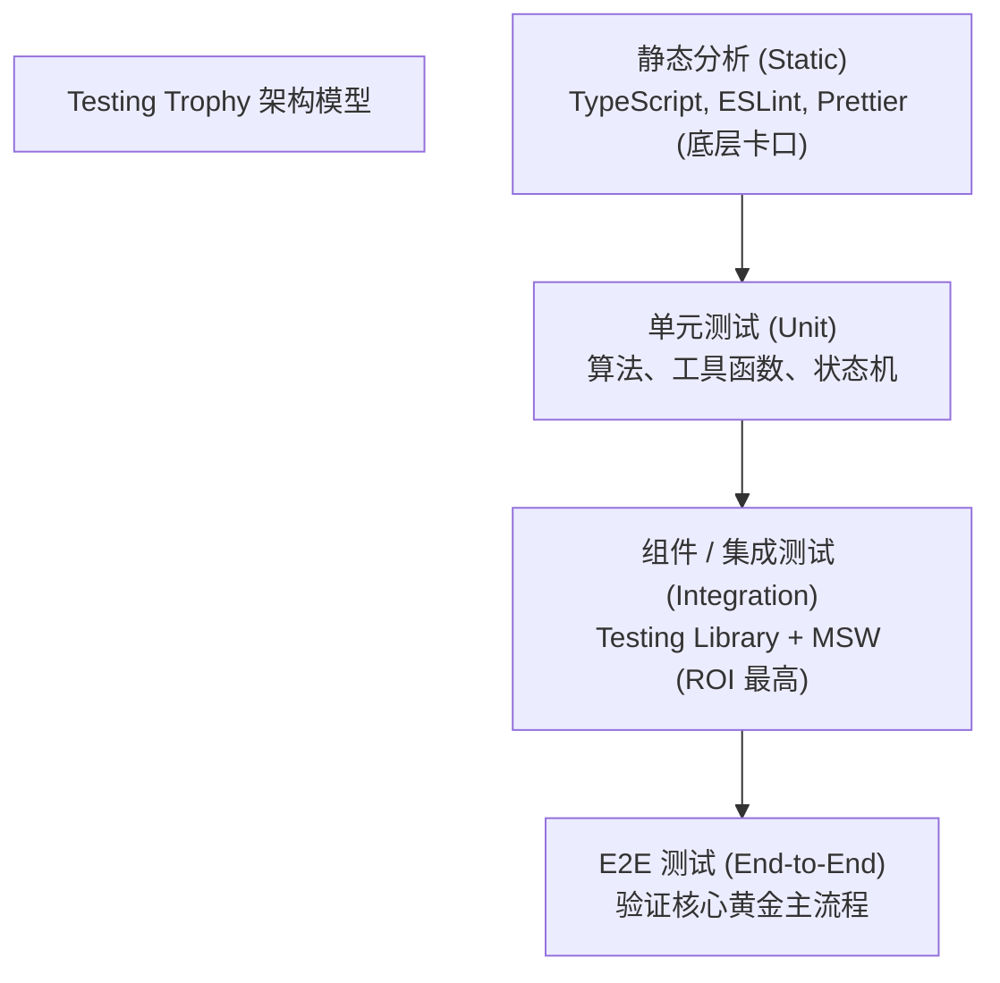
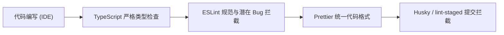
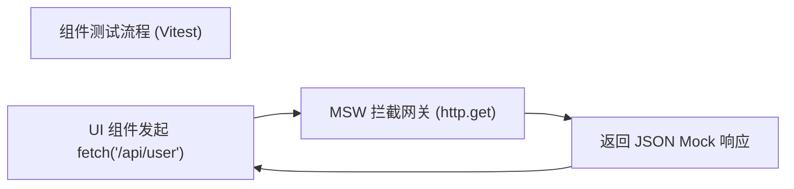
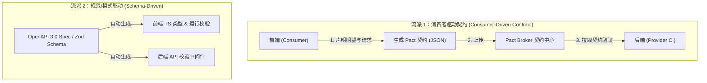
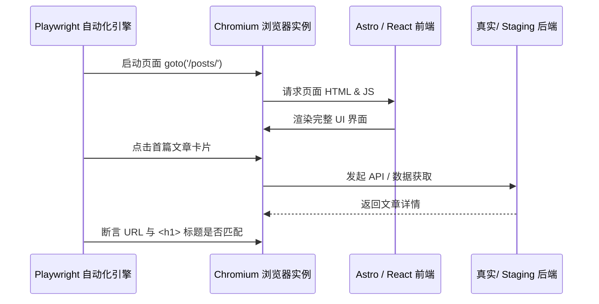
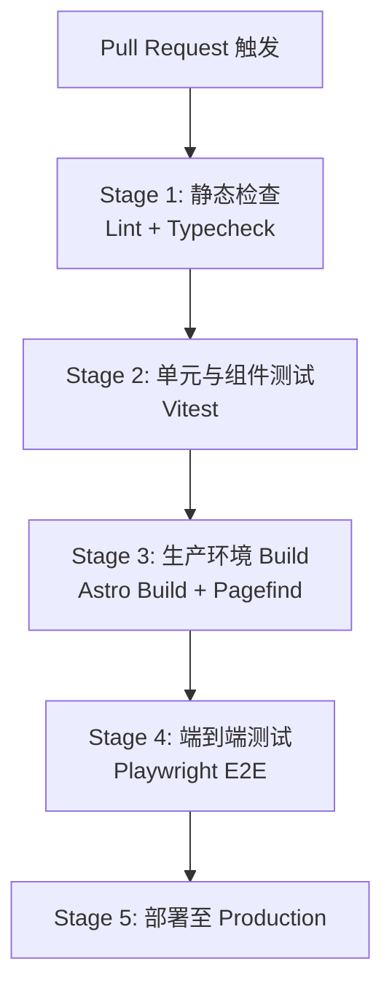
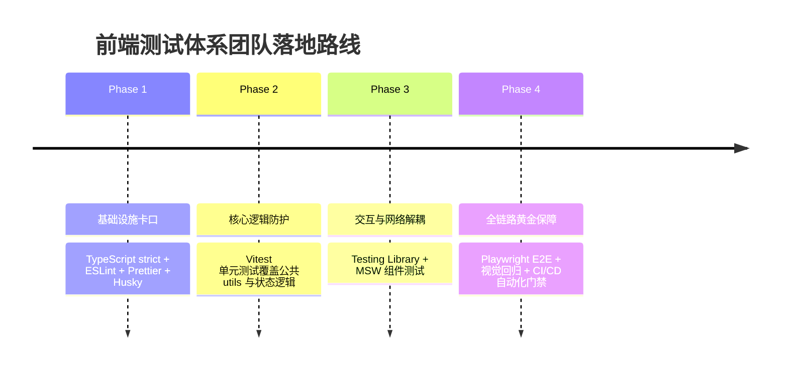

## 前言：从「能运行」到「可信赖的安全网」

在早期的 Web 开发中，前端页面大多是基于 HTML、CSS 与少量 JavaScript 编写的单向展示页。那时的“测试”往往非常简单：在浏览器里刷新页面，手动点击几个按钮，确认页面没有崩溃即可。

然而，随着 React、Vue、TypeScript、微前端以及元框架（如 Next.js、 Nuxt.js）的普及，现代前端早已演化为极其复杂的软件系统。一个看似简单的表单提交按钮，背后可能涉及：

- **状态管理**（Zustand / Redux / Pinia）
- **表单响应式校验**（Zod / React Hook Form）
- **权限与身份控制**（RBAC / JWT）
- **网络请求与数据转换**（Axios / TanStack Query）
- **路由跳转与持久化存储**（LocalStorage / IndexedDB）

在此背景下，仅仅依赖人工“点点点”的测试方式暴露出了严峻的工程瓶颈：

- **回归成本高昂**：每次修复 Bug 或重构代码，都需要人工重新走一遍漫长的业务流程。
- **隐蔽性故障频发**：修改公共组件或底层工具函数时，极易无意间破坏远离改动点的地方。
- **缺乏发布信心**：团队不敢轻易重构代码，导致项目沦为“能跑就别动”的遗留系统。

现代前端测试体系的目标，**不是追求 100% 覆盖率指标，也不是盲目编写大量低质量测试**，而是在合理成本下：

> 建立自动化质量屏障，让团队敢于重构、快速迭代并持续交付高质量产品。

---

## 一、 测试模型与场景选型：Pyramid vs Trophy

建立测试体系的第一步，是确定合理的测试分层与选型矩阵。

### 1. 经典测试金字塔 vs 现代测试奖杯

传统软件工程常用“测试金字塔 (Testing Pyramid)”模型，强调以大量的**单元测试**为基石。但在组件化和 Hook 驱动的现代前端范式中，Kent C. Dodds 提出的**测试奖杯 (Testing Trophy)** 模型更契合前端开发实际：



| 测试分层             | 关注重点                                     | 代表工具                         | ROI (投入产出比)       | 建议占比     |
| :------------------- | :------------------------------------------- | :------------------------------- | :--------------------- | :----------- |
| **L0 静态检查**      | 语法错误、类型推导、代码格式                 | TypeScript, ESLint, Prettier     | **极高**（零成本）     | 100% 全覆盖  |
| **L1 单元测试**      | 纯工具函数、独立算法、数据转换               | Vitest, Jest                     | **高**                 | 覆盖核心逻辑 |
| **L2 组件/集成测试** | 用户交互、DOM 渲染、Hook 状态、API 拦截      | Testing Library, MSW             | **最高**（前端核心）   | 占比最大     |
| **L3 契约测试**      | 前后端接口 API Schema 协议一致性             | OpenAPI, Pact                    | **高**（多团队协作）   | 核心接口     |
| **L4 E2E 测试**      | 真实浏览器链路、登录/下单/支付主流程         | Playwright                       | **中**（维护成本较高） | 覆盖黄金流程 |
| **L5 专项测试**      | 视觉回归、可访问性 (a11y)、性能 (Web Vitals) | Playwright, axe-core, Lighthouse | **高**（特定场景）     | 按需配置     |

---

## 二、 L0 静态质量保障：零成本的第一道防线

静态代码检查在代码编译或打包前执行，不依赖运行时环境，是拦截语法与类型错误最经济的方式。



### 1. TypeScript 严格模式 (`strict: true`)

在 `tsconfig.json` 中开启 `"strict": true`，可以在编译阶段提前拦截大部分空指针异常（`undefined is not a function`）：

```ts
interface UserProfile {
  id: string
  name: string
  roles?: string[]
}

// 编译阶段判空拦截
export function getPrimaryRole(user: UserProfile): string {
  return user.roles?.[0] ?? 'guest'
}
```

### 2. ESLint 与 Prettier 职责分离

- **ESLint**：管代码质量（捕获未调用的 `await`、违规 React Rules of Hooks 等）。推荐使用 ESLint Flat Config (`eslint.config.js`)。
- **Prettier**：管代码美观（缩进、分号、单双引号）。

借助 Husky 和 `lint-staged`，可以在 Git commit 触发时仅对增量修改文件执行检查：

```json
// .lintstagedrc
{
  "*.{ts,tsx}": ["eslint --fix", "prettier --write"],
  "*.{css,md,json}": ["prettier --write"]
}
```

---

## 三、 L1 单元测试与状态/Hook 逻辑测试 (Vitest)

在 Vite 生态中，**Vitest** 已替代 Jest 成为首选框架。它与 Vite 共享转换 Pipeline，支持 ESM、HMR 和极速的并发执行。

### 1. 核心哲学：测试行为，而非实现细节

> **The more your tests resemble the way your software is used, the more confidence they can give you.** —— Kent C. Dodds

- **错误做法（测试实现细节）**：断言组件内部 state `isOpen === true`。重构内部实现时，即使功能完全正常，测试也会断言失败。
- **正确做法（测试行为结果）**：模拟点击按钮，断言界面上是否出现了期望的弹窗标题文本。

### 2. 纯工具函数单元测试

工具函数是单元测试的天然落脚点：

```ts
// utils/formatPrice.ts
export function formatPrice(amount: number, currency = 'CNY'): string {
  if (Number.isNaN(amount) || amount < 0) return '¥0.00'
  return new Intl.NumberFormat('zh-CN', {
    style: 'currency',
    currency,
  }).format(amount)
}

// tests/unit/formatPrice.test.ts
import { describe, expect, it } from 'vitest'
import { formatPrice } from '@/utils/formatPrice'

describe('formatPrice', () => {
  it('应当正确格式化标准金额', () => {
    expect(formatPrice(1234.56)).toBe('¥1,234.56')
  })

  it('遇到 NaN 或负数时应当安全降级返回零值', () => {
    expect(formatPrice(NaN)).toBe('¥0.00')
    expect(formatPrice(-50)).toBe('¥0.00')
  })
})
```

### 3. 自定义 React Hook 测试

使用 `@testing-library/react` 的 `renderHook` 与 `act`，可以脱离 UI 组件独立测试 Hook 的状态流转：

```ts
// hooks/useCounter.ts
import { useCallback, useState } from 'react'

export function useCounter(initialValue = 0) {
  const [count, setCount] = useState(initialValue)
  const increment = useCallback(() => setCount((c) => c + 1), [])
  const decrement = useCallback(() => setCount((c) => c - 1), [])
  return { count, increment, decrement }
}

// tests/unit/useCounter.test.ts
import { act, renderHook } from '@testing-library/react'
import { describe, expect, it } from 'vitest'
import { useCounter } from '@/hooks/useCounter'

describe('useCounter', () => {
  it('应当支持正确递增与递减状态', () => {
    const { result } = renderHook(() => useCounter(10))

    expect(result.current.count).toBe(10)

    act(() => {
      result.current.increment()
    })
    expect(result.current.count).toBe(11)

    act(() => {
      result.current.decrement()
    })
    expect(result.current.count).toBe(10)
  })
})
```

---

## 四、 L2 组件测试与 API Mocking 深度实践

组件测试涵盖 DOM 渲染、用户真实交互以及网络请求隔离。

### 1. React Testing Library 查询优先级指南

选择器定位的稳定性决定了测试的可维护性。RTL 官方推荐优先级如下：

1. **`getByRole` / `findByRole`**（最高优先级）：最符合无障碍与实际用户认知。如 `getByRole('button', { name: /提交/i })`。
2. **`getByLabelText` / `getByPlaceholderText`**：适合表单输入框。
3. **`getByText`**：适合非交互式文本定位。
4. **`getByTestId`**（兜底方案）：仅在文本动态多变时使用。
5. **禁用 CSS 选择器**：坚决避免使用 `container.querySelector('.btn-primary')`。

### 2. 网络解耦的标准利器：MSW (Mock Service Worker)

**MSW (Mock Service Worker)** 通过在 Node.js 环境中拦截底层 Network 层（或在浏览器中使用 Service Worker），实现了无侵入的真实 HTTP 拦截：



#### MSW Handlers 配置实战

```ts
// tests/mocks/handlers.ts
import { http, HttpResponse } from 'msw'

export const handlers = [
  http.get('/api/user', () => {
    return HttpResponse.json({
      id: 'usr_123',
      name: 'Miles Pan',
      email: 'miles@example.com',
    })
  }),

  http.post('/api/login', async ({ request }) => {
    const body = (await request.json()) as { username?: string }
    if (body.username === 'admin') {
      return HttpResponse.json({ token: 'fake_jwt_token' })
    }
    return new HttpResponse(null, { status: 401 })
  }),
]
```

#### 组件异步交互测试代码示例

借助 `@testing-library/user-event` 模拟真实用户的输入与点击事件：

```tsx
// components/UserProfileCard.tsx
import { useEffect, useState } from 'react'

export function UserProfileCard() {
  const [user, setUser] = useState<{ name: string } | null>(null)
  const [error, setError] = useState(false)

  useEffect(() => {
    fetch('/api/user')
      .then((res) => {
        if (!res.ok) throw new Error('Fetch failed')
        return res.json()
      })
      .then((data) => setUser(data))
      .catch(() => setError(true))
  }, [])

  if (error) return <div role="alert">加载用户信息失败</div>
  if (!user) return <div>加载中...</div>
  return <h2>欢迎回来，{user.name}</h2>
}

// tests/components/UserProfileCard.test.tsx
import { render, screen, waitFor } from '@testing-library/react'
import { describe, expect, it } from 'vitest'
import { UserProfileCard } from '@/components/UserProfileCard'

describe('<UserProfileCard />', () => {
  it('应当在接口请求成功后展示用户名', async () => {
    render(<UserProfileCard />)

    expect(screen.getByText('加载中...')).toBeInTheDocument()

    await waitFor(() => {
      expect(screen.getByRole('heading', { level: 2 })).toHaveTextContent('欢迎回来，Miles Pan')
    })
  })
})
```

---

## 五、 L3 前后端契约测试 (Contract Testing) 深度实践

在现代分布式架构与前后端分离开发模式下，前端与后端往往处于并行开发状态。然而，这引入了一个极其痛点的工程隐患：**“本地联调没问题，部署线上面崩溃”**。

典型的破坏性变更（Breaking Changes）包括：

- 后端将响应字段 `user_name` 悄悄改为了 `userName`；
- 后端把某个原本必填的字符串字段改成了 `null`；
- 后端删除了枚举值中的某个选项，而前端代码中未作安全防御。

传统的解决方式有两种：

1. **依靠集成测试 / E2E 测试**：需要部署全套后端与数据库环境，运行耗时极长、环境稳定性极差。
2. **人工沟通与 Swagger 文档**：依靠口头约定或 Wiki，文档极易失效与滞后。

**契约测试（Contract Testing）** 正是为了解决这一矛盾而生。它的核心思想是：**将 API 交互规范抽象为一份可执行的“契约（Contract File）”，并在 CI 中分别对前端（Consumer）与后端（Provider）进行独立自动化校验**。

---

### 1. 契约测试的两大流派：CDCT vs Schema-Driven



#### A. 消费者驱动契约测试 (Consumer-Driven Contract Testing, CDCT)

- **核心代表**：[Pact](https://docs.pact.io/)
- **运作原理**：由前端（Consumer）定义自己调用的 API 格式与预期响应数据，运行测试后自动生成标准的 Pact JSON 契约文件。随后在后端的 CI 流水线中，自动拉取这份契约针对后端的真实控制器（Controller）发起测试。
- **适用场景**：大型微服务架构、同一后端服务于 Web、iOS、Android 等多个不同终端。

#### B. 规范驱动契约测试 (Schema-Driven Contract Testing)

- **核心代表**：OpenAPI 3.0 (Swagger) + `zod` / `openapi-typescript`
- **运作原理**：以一份 Single Source of Truth（如 OpenAPI 3.0 YAML/JSON）为中心。前端自动生成 TypeScript Interface，并在客户端发起请求时，使用 `zod` 在运行时对后端返回的数据体进行 Strict Runtime Validation。

---

### 2. Pact.js 契约测试实战（前端 Consumer 端）

以下展示前端如何使用 `@pact-foundation/pact` 编写契约测试，并自动生成 Pact 契约产物：

```ts
// tests/contract/userContract.test.ts
import { MatchersV3, PactV3 } from '@pact-foundation/pact'
import { describe, expect, it } from 'vitest'

// 1. 初始化 Pact Mock 服务提供者
const provider = new PactV3({
  consumer: 'FrontendWebApp',
  provider: 'UserService',
  dir: './tests/contracts', // 契约产物保存目录
})

describe('用户服务 API 契约校验', () => {
  it('验证 /api/users/:id 契约约束', async () => {
    // 2. 声明前端对 API 的请求预期与响应数据结构
    provider
      .given('用户 123 存在')
      .uponReceiving('获取用户 123 详细信息的请求')
      .withRequest({
        method: 'GET',
        path: '/api/users/123',
        headers: {
          Accept: 'application/json',
        },
      })
      .willRespondWith({
        status: 200,
        headers: { 'Content-Type': 'application/json; charset=utf-8' },
        body: {
          id: MatchersV3.string('123'),
          username: MatchersV3.string('Miles Pan'),
          email: MatchersV3.regex(
            '^[a-zA-Z0-9._%+-]+@[a-zA-Z0-9.-]+\\.[a-zA-Z]{2,}$',
            'miles@example.com'
          ),
          role: MatchersV3.equal('admin'),
        },
      })

    // 3. 执行契约校验
    await provider.executeTest(async (mockServer) => {
      const response = await fetch(`${mockServer.url}/api/users/123`, {
        headers: { Accept: 'application/json' },
      })
      const data = await response.json()

      expect(response.status).toBe(200)
      expect(data.username).toBe('Miles Pan')
    })
  })
})
```

测试执行成功后，会在 `./tests/contracts/` 自动生成 Pact 契约文件。若后端修改字段类型（如将 `username` 改为 `user_name`），后端的 CI 校验就会爆红打断合并。

---

### 3. 基于 Zod 的运行时契约防护 (Runtime Schema Protection)

即使编译期 TypeScript 类型检查通过，但真实的网络响应依然可能在运行时出现非预期的数据蜕变。在 API Fetch 封包中集成 `zod` 可以做到 100% 运行时防爆：

```ts
// api/userApi.ts
import { z } from 'zod'

// 定义接口运行期强契约
export const UserResponseSchema = z.object({
  id: z.string(),
  username: z.string(),
  email: z.string().email(),
  avatarUrl: z.string().url().optional(),
  status: z.enum(['active', 'suspended', 'pending']),
})

export type UserResponse = z.infer<typeof UserResponseSchema>

// 带契约校验的通用请求封装
export async function fetchUserProfile(userId: string): Promise<UserResponse> {
  const response = await fetch(`/api/users/${userId}`)
  if (!response.ok) throw new Error(`HTTP Error ${response.status}`)

  const rawData = await response.json()

  // 运行时 Strict Parse：如果后端返回了未约定的字段或破坏性类型改动，立刻触发格式化异常
  const parseResult = UserResponseSchema.safeParse(rawData)
  if (!parseResult.success) {
    console.error('API 契约破裂异常:', parseResult.error.format())
    throw new Error('API 响应数据违背了前端契约规范')
  }

  return parseResult.data
}
```

---

### 4. 三大测试技术粒度对比 (MSW vs Pact vs E2E)

| 维度           | MSW (API Mocking)            | Pact (Contract Testing)           | Playwright (E2E Testing)       |
| :------------- | :--------------------------- | :-------------------------------- | :----------------------------- |
| **测试焦点**   | 前端 UI/组件的异步逻辑验证   | 前后端 API 交互 Schema 约定一致性 | 全系统连通性与真实用户黄金流程 |
| **运行速度**   | 极快 (毫秒级)                | 极快 (秒级)                       | 较慢 (分钟级)                  |
| **外部依赖**   | 纯前端本地 Mock (无后端参与) | 需要生成 Pact JSON / 上传 Broker  | 需要启动完整的全局后端服务     |
| **防破坏能力** | 防前端改动破坏组件           | **防后端 API 改动破坏前端应用**   | 防全链路破坏                   |

---

## 六、 L4 端到端测试 (E2E) 与视觉回归测试 (Playwright)

端到端（E2E）测试拉起真实浏览器环境（Chromium, Firefox, WebKit），验证完整的系统链路。Playwright 是现代 Web 端到端测试的最佳选择。



### 1. Page Object Model (POM) 模式

POM 模式通过将页面元素与交互封装为对象，实现测试用例与 DOM 结构的解耦：

```ts
// tests/e2e/pom/PostsPage.ts
import type { Locator, Page } from '@playwright/test'

export class PostsPage {
  readonly page: Page
  readonly heading: Locator
  readonly searchInput: Locator
  readonly postCards: Locator

  constructor(page: Page) {
    this.page = page
    this.heading = page.getByRole('heading', { level: 1 })
    this.searchInput = page.getByPlaceholder(/搜索文章/i)
    this.postCards = page.locator('article')
  }

  async goto() {
    await this.page.goto('/posts/')
  }

  async search(query: string) {
    await this.searchInput.fill(query)
  }
}

// tests/e2e/posts.spec.ts
import { expect, test } from '@playwright/test'
import { PostsPage } from './pom/PostsPage'

test.describe('文章列表页 E2E', () => {
  test('应当能正常浏览并搜索文章', async ({ page }) => {
    const postsPage = new PostsPage(page)
    await postsPage.goto()

    await expect(postsPage.heading).toBeVisible()
    await expect(postsPage.postCards.first()).toBeVisible()
  })
})
```

### 2. 视觉回归测试 (Visual Regression Testing)

对于 UI 组件库或设计敏感页面，Playwright 内置的快照比对可以有效防止 CSS 布局错乱：

```ts
test('页面整体布局应当符合视觉设计快照', async ({ page }) => {
  await page.goto('/')
  await expect(page).toHaveScreenshot('homepage-layout.png', {
    maxDiffPixelRatio: 0.01,
  })
})
```

---

## 七、 L5 专项测试深度指南：可访问性、性能与安全防护

专项测试（Specialized Testing）旨在保障软件在功能正常之外的**非功能性质量（Non-functional Requirements）**。在企业级 Web 开发中，缺乏专项测试往往会导致应用陷入“功能正常但性能卡顿”、“无障碍合规面临法律诉讼”、“存在严重 XSS/CSRF 漏洞”的困局。

---

### 1. 可访问性测试 (Accessibility / a11y)

无障碍体验（Accessibility, a11y）确保残障人士、屏幕阅读器用户以及纯键盘操作用户可以无障碍使用 Web 应用。WCAG (Web Content Accessibility Guidelines) 2.1 / 2.2 是国际通用的合规标准。

#### A. 自动化规范扫描与规则防护

借助 `@axe-core/playwright` 扩展包，可以在 Playwright E2E 测试中自动化检测当前 DOM 树的 WCAG 违规行为（如颜色对比度过低、`` 标签缺失 `alt` 文本、Form Input 缺失 `<label>` 绑定等）：

```ts
// tests/e2e/accessibility.spec.ts
import { expect, test } from '@playwright/test'
import AxeBuilder from '@axe-core/playwright'

test.describe('网站无障碍 (a11y) 自动化合规扫描', () => {
  test('首页应当零 WCAG 严重违规项', async ({ page }) => {
    await page.goto('/')

    // 执行 axe 引擎静态与 DOM 规则审计
    const accessibilityScanResults = await new AxeBuilder({ page })
      .withTags(['wcag2a', 'wcag21a', 'wcag21aa']) // 指定 WCAG 2.1 AA 级标准
      .disableRules(['color-contrast']) // 可选：排除特定提示级规则
      .analyze()

    // 违规结果断言
    expect(accessibilityScanResults.violations).toEqual([])
  })
})
```

#### B. 键盘交互与 Focus Indicator 测试

屏幕阅读器和键盘使用者完全依赖 `Tab` 键在页面可点击元素间跳转。核心测试点包括：

- 键盘焦点环（Focus Ring）不可被 `outline: none` 抹杀；
- 弹窗（Modal / Dialog）打开时，焦点必须被锁死在弹窗内部（Focus Trap），按下 `Esc` 键必须正确关闭弹窗并将焦点归还原按钮。

```ts
test('Modal 弹窗应当符合键盘 Focus Trap 约束', async ({ page }) => {
  await page.goto('/')

  // 触发打开 Modal
  await page.getByRole('button', { name: /打开设置/i }).click()
  const modal = page.getByRole('dialog', { name: /设置面板/i })
  await expect(modal).toBeVisible()

  // 验证按下 Esc 键关闭弹窗
  await page.keyboard.press('Escape')
  await expect(modal).toBeHidden()
})
```

---

### 2. 前端性能测试与 Core Web Vitals 自动化门禁

前端性能直接关系到用户的留存率与 SEO 排名。现代 Web 性能测试侧重于 Google 提出的三大 **Core Web Vitals** 核心指标：

| 性能指标                            | 衡量目标                          | 优秀标准 (< Good) | 常见优化方向                                         |
| :---------------------------------- | :-------------------------------- | :---------------- | :--------------------------------------------------- |
| **LCP** (Largest Contentful Paint)  | 首屏最大内容块渲染时间            | **≤ 2.5 秒**      | 图片预加载 (preload)、SSR/SSG 静态输出、CDN 加速     |
| **CLS** (Cumulative Layout Shift)   | 页面视觉元素的累积布局偏移        | **≤ 0.1**         | 显式指定 `img`/`video` 宽高、避免无尺寸异步广告插屏  |
| **INP** (Interaction to Next Paint) | 用户点击/按键到下次画面刷新的延迟 | **≤ 200 毫秒**    | 拆分 Long Task、使用 `startTransition` / Web Workers |

#### A. Lighthouse CI (LHCI) 在 GitHub Actions 中的卡口集成分步

创建 `.lighthouserc.json` 配置文件，在 CI 打包完成后启动 headless Chrome 对网页进行性能基准检测：

```json
// .lighthouserc.json
{
  "ci": {
    "collect": {
      "staticDistDir": "./dist",
      "numberOfRuns": 3
    },
    "assert": {
      "assertions": {
        "categories:performance": ["error", { "minScore": 0.85 }],
        "categories:accessibility": ["error", { "minScore": 0.9 }],
        "first-contentful-paint": ["error", { "maxNumericValue": 2000 }],
        "interactive": ["error", { "maxNumericValue": 3500 }]
      }
    }
  }
}
```

#### B. 利用 Playwright CDP 协议提取底层 Performance Metrics

在 E2E 测试中，可以直接通过 Chrome DevTools Protocol (CDP) 提取微秒级的性能 Timing 数据：

```ts
test('评估关键页面首屏加载与内存占用', async ({ page, context }) => {
  const cdpSession = await context.newCDPSession(page)
  await cdpSession.send('Performance.enable')

  await page.goto('/')

  // 获取页面 Performance Metrics
  const metrics = await cdpSession.send('Performance.getMetrics')
  const metricMap = Object.fromEntries(metrics.metrics.map((m) => [m.name, m.value]))

  // 断言 JS 堆内存占用低于上限 (例如 50MB)
  expect(metricMap['JSHeapUsedSize']).toBeLessThan(50 * 1024 * 1024)
})
```

---

### 3. 前端安全测试 (Security Testing)

前端安全防线聚焦于跨站脚本攻击（XSS）、跨站请求伪造（CSRF）以及依赖供应链安全。

#### A. XSS (Cross-Site Scripting) 自动化注入测试

在组件测试中，测试动态渲染的用户输入内容（如评论框、MDX 富文本）是否妥善转义：

```tsx
// tests/security/xss.test.tsx
import { render, screen } from '@testing-library/react'
import { describe, expect, it } from 'vitest'
import { CommentItem } from '@/components/CommentItem'

describe('安全注入防范测试', () => {
  it('应当妥善转义恶意的 XSS Script 脚本标签', () => {
    const maliciousPayload = `<script>alert('xss')</script>`

    render(<CommentItem content={maliciousPayload} />)

    // 断言 DOM 中绝不会执行脚本注入
    expect(window.__xss__).toBeUndefined()
    expect(screen.getByText(/<script>/i)).toBeInTheDocument()
  })
})
```

#### B. 依赖项供应链安全与敏感凭证检查

1. **依赖漏洞自动扫描**：在 CI 中运行 `pnpm audit --audit-level=high` 拦截具备 High / Critical 级别 CVE 漏洞的第三方 npm 包。
2. **Git 静态凭证防泄露 (Secret Scanning)**：借助 `git-leaks` 或 `trufflehog`，防止开发人员无意将 `.env` 秘钥打包至前端静态产物中。

---

## 八、 CI/CD 自动化质量门禁与 Flaky Test 治理

### 1. GitHub Actions 高效流水线



```yaml
name: CI Quality Gate

on:
  push:
    branches: [main]
  pull_request:
    branches: [main]

jobs:
  static-analysis:
    runs-on: ubuntu-latest
    steps:
      - uses: actions/checkout@v4
      - uses: pnpm/action-setup@v3
      - uses: actions/setup-node@v4
        with:
          node-version: 22
          cache: 'pnpm'
      - run: pnpm install --frozen-lockfile
      - run: pnpm lint
      - run: pnpm typecheck

  unit-and-component-tests:
    needs: static-analysis
    runs-on: ubuntu-latest
    steps:
      - uses: actions/checkout@v4
      - uses: pnpm/action-setup@v3
      - uses: actions/setup-node@v4
        with:
          node-version: 22
          cache: 'pnpm'
      - run: pnpm install --frozen-lockfile
      - run: pnpm test

  e2e-tests:
    needs: unit-and-component-tests
    runs-on: ubuntu-latest
    steps:
      - uses: actions/checkout@v4
      - uses: pnpm/action-setup@v3
      - uses: actions/setup-node@v4
        with:
          node-version: 22
          cache: 'pnpm'
      - run: pnpm install --frozen-lockfile
      - run: pnpm build
      - run: pnpm test:e2e
```

### 2. Flaky Test (不稳定测试) 治理

- **避免固定等待**：坚决禁止使用 `setTimeout(3000)`，始终使用 Playwright / RTL 的显式自动等待断言。
- **环境与状态隔离**：每个测试用例前通过 `beforeEach` 重置数据库 / LocalStorage / MSW Handlers。

### 3. 测试覆盖率分级策略

| 模块类型                     | 目标覆盖率          | 策略建议                      |
| :--------------------------- | :------------------ | :---------------------------- |
| **基础工具库 / 公共 utils**  | **90%+**            | 高度复用，必须严格保护        |
| **核心业务 Hook / 状态管理** | **80%+**            | 验证状态流转边界情况          |
| **通用 UI 组件库**           | **70%-80%**         | 重点关注不同 Props 与事件响应 |
| **标准页面与展示层**         | **按需 / E2E 覆盖** | 依靠 E2E 覆盖黄金主流程即可   |

---

## 总结：团队落地路线图

搭建现代前端测试体系宜采取**渐进式演进策略**：



测试不是研发负担，而是软件工程持续快速演进的坚实安全网。
